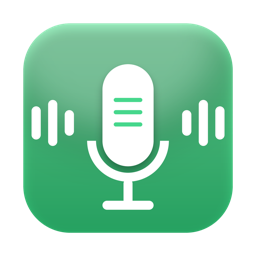
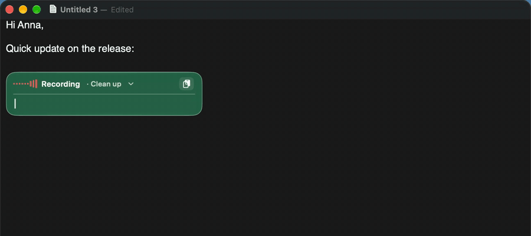
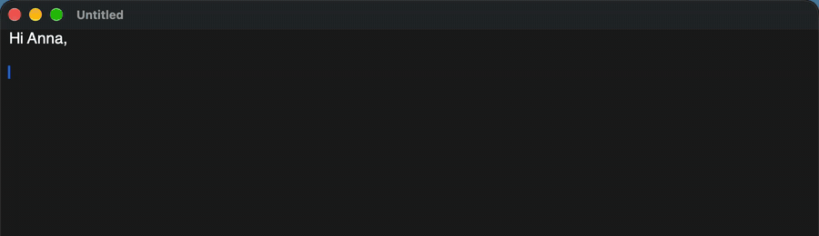
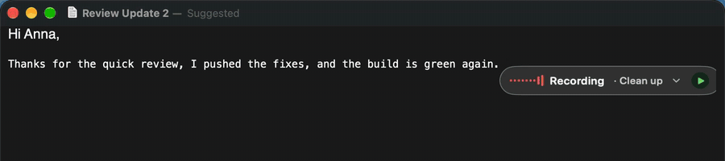
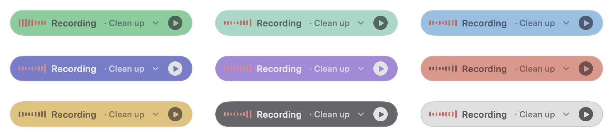
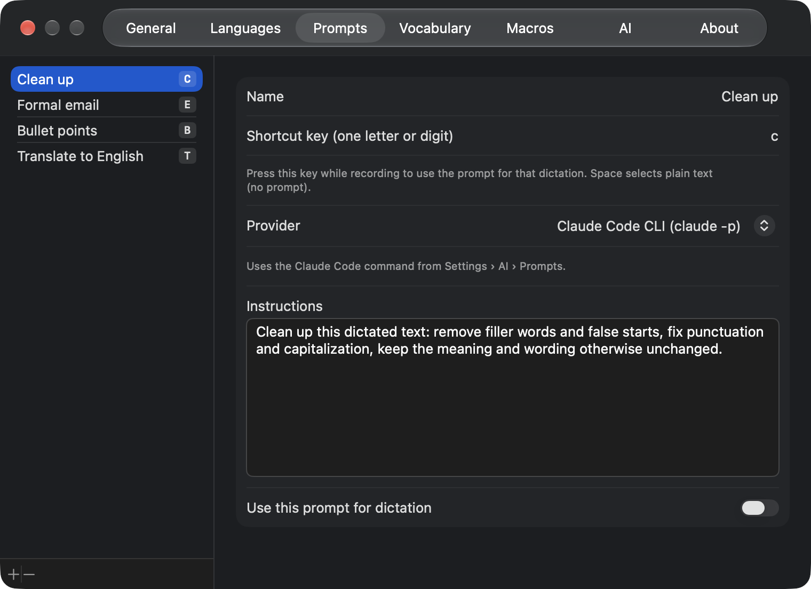
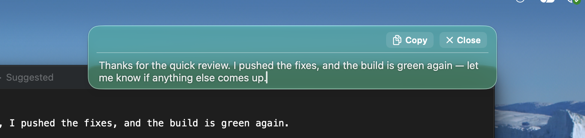
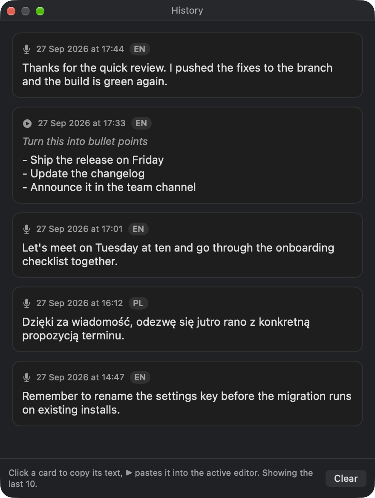
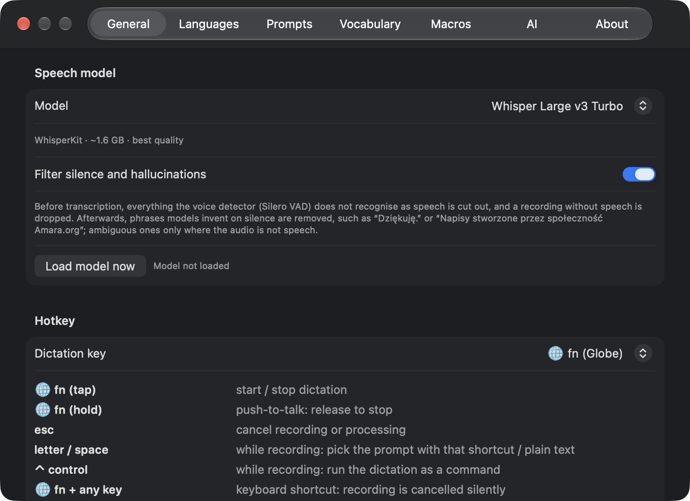

<p align="center">
  
</p>

<h1 align="center">SimpleWhisper</h1>

<p align="center">
  <b>Private dictation for macOS.</b> Press <kbd>fn</kbd>, speak, and your words land wherever you type,<br>
  transcribed on your Mac.
</p>

<p align="center">
  
  
  <a href="LICENSE"></a>
  <a href="https://github.com/mwgo/SimpleWhisper/releases/latest"></a>
</p>

<p align="center">
  <a href="https://github.com/mwgo/SimpleWhisper/releases/latest"></a>
  &nbsp;
  <a href="#documentation"></a>
</p>

<p align="center"><sub>Free and open source. No account, no subscription.</sub></p>

<p align="center">
  
  <br>
  <sub>Live typing: words appear as you speak, greyed while provisional, then confirmed at each pause.</sub>
</p>

<table>
  <tr>
    <td width="33%" valign="top">
      <h3>One key, any app</h3>
      Tap <kbd>fn</kbd> to start and stop, or hold it to talk. The text is pasted into Word, Teams, VS Code, Rider, Mail or wherever the cursor is.
    </td>
    <td width="33%" valign="top">
      <h3>Stays on your Mac</h3>
      Whisper, Parakeet and Apple Speech run locally on Apple Silicon. A cloud engine is there only if you choose it.
    </td>
    <td width="33%" valign="top">
      <h3>Polish it with AI</h3>
      Named prompts clean up, format or translate a dictation. Command mode rewrites selected text with a spoken instruction.
    </td>
  </tr>
</table>

## Tap, talk, done

A small HUD appears next to the caret while you speak. Tap <kbd>fn</kbd> again and the transcription is pasted in place. <kbd>Esc</kbd> cancels at any moment.



## Always know what it is doing

The HUD shows the microphone level while recording, a rainbow edge while transcribing and while an AI prompt runs, and folds away when it is done. It floats in Liquid Glass tinted with one of nine colours.




## Prompts and commands

<table>
  <tr>
    <td width="48%" valign="top">
      Pick a prompt from the HUD, or press its letter while recording: <b>Clean up</b>, <b>Formal email</b>, <b>Bullet points</b>, <b>Translate to English</b>, or your own.
      <br><br>
      Select text, say what to do with it and press <kbd>Control</kbd>: the selection is replaced with the result. With nothing selected, your question goes to the assistant.
      <br><br>
      <sub>Works with Claude Code, Codex, Gemini CLI, Agy, your own shell command, the Claude, OpenAI and Gemini APIs, or Apple Intelligence.</sub>
    </td>
    <td width="52%" valign="top">
      
    </td>
  </tr>
</table>

## Nowhere to paste? It waits for you

Dictating over a Finder window or a web page with no text field? The text stays in the HUD, still editable, with **Copy** and **Close**.



## History and settings

<table>
  <tr>
    <td width="32%" valign="top">
      <br>
      <sub>History (opt-in): click to copy, ▶ to paste again.</sub>
    </td>
    <td width="68%" valign="top">
      <br>
      <sub>Settings: models, hotkeys, HUD, languages, vocabulary, voice macros and AI providers.</sub>
    </td>
  </tr>
</table>

## Speech models

| Model | Runs | Good for |
|---|---|---|
| Whisper Large v3 Turbo | On device · ~1.6 GB | Best quality, many languages |
| Whisper Large v3 | On device · 626 MB | Recommended by Argmax, smaller download |
| Whisper Small | On device · ~200 MB | Quick tests |
| Parakeet v3 | On device · ~0.6 GB | Very fast, 25 European languages |
| Parakeet Ultra | On device · ~0.6 GB | Parakeet v3 post-trained for accuracy, same speed |
| Apple Speech | Built into macOS | No download |
| Gemini API | Cloud · your API key | Optional; the recording is sent to Google |

A silence and hallucination filter (Silero VAD) keeps invented phrases like “Thank you.” out of your text.

## Install

1. Download the latest `SimpleWhisper-x.y.z.zip` from [Releases](https://github.com/mwgo/SimpleWhisper/releases/latest), unzip it and move **SimpleWhisper** to Applications.
2. The app is not notarized yet, so clear the quarantine flag once:
   ```bash
   xattr -dr com.apple.quarantine /Applications/SimpleWhisper.app
   ```
3. Open it and allow **Microphone**, **Accessibility** and **Input Monitoring** when asked.
4. Press <kbd>fn</kbd> and start talking. Turn on automatic updates in Settings › General › Updates.

---

## Documentation

The full reference, folded into sections. Click a section to open it.

<details>
<summary><b>Hotkeys</b></summary>

| Key | Action |
|---|---|
| <kbd>fn</kbd> (tap) | Start / stop dictation |
| <kbd>fn</kbd> (hold, > 0.4 s) | Push-to-talk: release to stop |
| <kbd>Esc</kbd> | Cancel recording or processing |
| Letter / <kbd>Space</kbd> | While recording: pick the prompt with that shortcut / plain text |
| <kbd>Control</kbd> | While recording: run the dictation as a command on the selection |
| <kbd>Control</kbd> + letter / <kbd>Space</kbd> | In Live typing: pick a prompt / plain text (letters type into the editor) |
| <kbd>fn</kbd> + any key | A keyboard shortcut: the recording is cancelled silently |

The dictation key can also be left/right Command or left/right Option (Settings › General › Hotkey). Optional **double-press mode**: two quick presses toggle, press-release-hold is push-to-talk, a single press does nothing. Pressing the dictation key together with another modifier (Control, Shift, Option, Command) never starts a recording.

</details>

<details>
<summary><b>Live typing</b></summary>

Settings › General › Output, or the menu bar. An editor opens under the HUD and fills with text as you speak: the utterance in progress is re-transcribed about once a second and shown greyed, and it is confirmed at the next pause (about 0.7 s) or after 25 s.

- Click anywhere to move the caret and keep dictating there, select text to replace it, or edit with the keyboard; the editor grows with the text.
- The clipboard button in the corner pastes the clipboard at the caret.
- Stop dictation (<kbd>fn</kbd>, or release <kbd>fn</kbd> in push-to-talk) to run the selected prompt and insert the result into the original app. <kbd>Esc</kbd> discards it (kept in History when enabled).
- While the editor is open, letters and space type into it; <kbd>Control</kbd> + a prompt's letter picks that prompt and <kbd>Control</kbd> + <kbd>Space</kbd> plain text.
- The Gemini API engine has no live preview (every call is billed); its text appears at pauses.

</details>

<details>
<summary><b>Prompts, command mode and AI providers</b></summary>

- **Prompts**: named AI prompts (Clean up, Formal email, Bullet points, Translate to English, your own) run through Claude Code CLI (`claude -p`), Codex CLI, Gemini CLI, Agy, a custom shell command, the Claude API, the OpenAI API, the Google Gemini API (keys in the Keychain) or Apple Intelligence. Clipboard and macro content is protected by placeholders so the AI never rewrites it.
- **Prompt shortcuts**: each prompt can have a letter; press it while recording to use that prompt, press <kbd>Space</kbd> for plain text. Clicking the HUD opens the prompt menu too.
- **Command mode** (Settings › General): select text in the editor, start dictation, say what to do with it (“convert to markdown”, “translate to English”, “make it shorter”) and click the round ▶ button in the HUD or press <kbd>Control</kbd> (while still holding fn, or after a short fn press). The selection is read (Accessibility, or ⌘C), sent to the AI command with your instruction, and the result replaces the selection. With nothing selected the dictation is a question to the assistant, and the answer opens as a Markdown document.
- Settings › AI has two parts, prompts and command mode/assistant, each with its own provider.

</details>

<details>
<summary><b>Languages, vocabulary and voice macros</b></summary>

- **Language**: auto-detect among a configurable set of languages (default English; any of Whisper's 99 languages can be added), a fixed language, or auto-detect anything. Mixed sentences are fine.
- **Vocabulary**: words the models tend to get wrong plus aliases that are always corrected in the final text.
- **Voice macros**: say “schowek” / “clipboard” to insert the clipboard content (captured when recording starts); “nowa linia” / “new line” for a line break; custom text macros.

</details>

<details>
<summary><b>Spoken punctuation</b></summary>

Macros of type Punctuation, Polish and English: “przecinek”/“comma”, “kropka”/“period”, “znak zapytania”, “wykrzyknik”, “dwukropek”, “średnik”, “myślnik”, “cudzysłów”, “nawias otwarty/zamknięty”, “nowy akapit”/“new paragraph”. Marks are placed with proper spacing, the next sentence is capitalised, and punctuation the model already inserted is merged rather than doubled. One switch in Settings › Macros turns it off when those words are meant literally.

</details>

<details>
<summary><b>HUD, sounds, history and the result card</b></summary>

- **Menu bar only** (no Dock icon). The HUD appears next to the text caret, or at the top or bottom of the screen, or not at all (Settings › General › HUD); nine colour themes, optional Liquid Glass background.
- **Sound cues** on recording start, stop and cancel (Settings › General › Output).
- **Nowhere to paste**: when no text field has focus, the text stays in the HUD card with Copy and Close (<kbd>Esc</kbd> closes). Markdown results and assistant answers open in a separate window, rendered, with a Source view to edit.
- **History** (opt-in, Settings › General): “History…” in the menu bar opens a floating window with the last 10 dictations and commands. Clicking a card copies it to the clipboard; ▶ pastes it into the active editor.
- **Launch at login** (Settings › General › Startup) via the system Login Items mechanism.

</details>

<details>
<summary><b>Speech engines, silence and hallucination filter</b></summary>

- Models download on first use: Whisper via WhisperKit, NVIDIA Parakeet v3 and Parakeet Ultra via FluidAudio, Apple's built-in recognizers, and the optional Gemini API (default model `gemini-2.5-flash`; API key from aistudio.google.com in Settings › General; the vocabulary list is passed in the instructions).
- **Filter silence and hallucinations** (on by default, Settings › General): before transcription the Silero voice detector (FluidAudio) cuts out everything that is not speech, and a recording without speech is dropped; afterwards phrases models invent on silence (“Dziękuję.”, “Thank you.”, “Napisy stworzone przez społeczność Amara.org”…) are removed, the ambiguous ones only where the audio under them is not speech.

</details>

<details>
<summary><b>Automatic updates</b></summary>

Off by default, Settings › General › Updates. Once a day the app looks for a newer GitHub release; when one is found and no dictation has run for a minute, it downloads the zip, checks the bundle identifier, version and signature, replaces itself in place and restarts. “Check for Updates…” in the menu bar checks right away.

</details>

<details>
<summary><b>Build & run</b></summary>

```bash
Scripts/make-app.sh            # release build → build/SimpleWhisper.app, then opens it
Scripts/make-app.sh debug      # faster debug build
```

The app icon is generated by `Scripts/make-icon.py` (Pillow) into `Resources/AppIcon.icns`.

Requires Xcode 26 / Swift 6.2. No Xcode project; it is a Swift Package plus a script that wraps the binary in an `.app` (needed for the permission prompts).

</details>

<details>
<summary><b>Permissions</b></summary>

System Settings › Privacy & Security:

| Permission | Why |
|---|---|
| Microphone | recording |
| Accessibility | paste via ⌘V, caret position for the HUD, global key listener |
| Input Monitoring | Globe/fn and Esc key detection |

Also set **System Settings › Keyboard › “Press Globe key to” → Do Nothing**, otherwise macOS opens the emoji picker or system dictation.

</details>

<details>
<summary><b>Test from the command line</b></summary>

The same binary can run the whole pipeline on an audio file (no microphone or permissions needed):

```bash
.build/release/SimpleWhisper --transcribe test.aiff --engine whisperSmall
.build/release/SimpleWhisper --transcribe test.aiff --engine parakeetV3 --language pl        # or pl,en,de / any
.build/release/SimpleWhisper --transcribe test.aiff --prompt "Clean up" --clipboard "some code"
.build/release/SimpleWhisper --transcribe test.aiff --live       # split at pauses like Live typing
.build/release/SimpleWhisper --transcribe test.aiff --no-filter  # without the silence/hallucination filter
.build/release/SimpleWhisper --apple-locales      # which locales Apple Speech supports/installed
.build/release/SimpleWhisper --ax-probe           # what the focused element in the front app looks like
.build/release/SimpleWhisper --hud-demo           # cycles the HUD through its animations
.build/release/SimpleWhisper --settings-demo      # opens the Settings view in a plain window
```

`--hud-demo` also takes `SW_HUD_LIVE=1` (Live typing editor), `SW_HUD_RESULT="text"` (result card), `SW_HUD_THEME`, `SW_HUD_PLACEMENT` and `SW_HUD_SOLID=1`. The last recording is kept as `~/Library/Application Support/SimpleWhisper/last-recording.wav` for `--transcribe`.

Generate test audio with the system voices: `say -v Zosia "Dzisiaj testuję enova365" -o test.aiff`.

</details>

<details>
<summary><b>Notes and limitations</b></summary>

- `claude -p` runs with **no tools** by default (`{tools}` in the command template becomes `--tools ""`): fast, and the model cannot read local files. Settings › AI › Command mode can allow WebFetch/WebSearch.
- `claude -p` needs several seconds (about 4 s with `--model haiku --setting-sources ""`, about 10 s with defaults). The HUD shows an elapsed-seconds counter while it runs.
- Do not add `--bare` to the `claude -p` command: it skips OAuth login and fails with “Not logged in”.
- **Apple Intelligence (Foundation Models) does not support Polish** text, so prompts default to Claude Code CLI. Apple Intelligence works for English-only text.
- **Apple Speech**: English uses the new `SpeechTranscriber`; Polish is not supported by it, so the older `DictationTranscriber` is used (lower quality). Whisper Large v3 Turbo or Parakeet v3 give much better Polish.
- Language auto-detection is restricted to the selected languages (default English) so short phrases are not mistaken for a similar language. Apple Speech supports only some languages (see `--apple-locales`); unsupported ones are skipped.
- Whisper decodes in the detected dominant language; English identifiers inside a Polish sentence are kept.
- Data lives in `~/Library/Application Support/SimpleWhisper/` (prompts, vocabulary, macros, history as JSON) and `UserDefaults`. Whisper models are cached in `~/Documents/huggingface/models/argmaxinc/whisperkit-coreml/`, Parakeet in `~/Library/Application Support/FluidAudio/`.
- HUD placement: native text views report the caret rectangle via Accessibility. Electron apps (VS Code, Slack, Teams) report a bogus 0×0 caret, so the frame of the focused text field is used instead. Diagnostics go to `~/Library/Application Support/SimpleWhisper/debug.log`.
- The app is signed ad-hoc with a designated requirement based only on the bundle identifier, so Accessibility / Input Monitoring grants survive rebuilds. If they ever get stuck, run `tccutil reset Accessibility pl.wojas.SimpleWhisper` (and `ListenEvent`, `PostEvent`, `Microphone`).

</details>

<details>
<summary><b>Project layout</b></summary>

```
Sources/SimpleWhisper/
  App/        entry point, menu bar UI, DictationController (pipeline), Updater, CLI and demo modes
  Hotkey/     CGEventTap listener for the dictation key and Esc, permissions helpers
  Audio/      AVAudioEngine recorder → 16 kHz mono Float32, pause detection for Live typing
  Engines/    SpeechEngine protocol, WhisperKit / Parakeet / Apple / Gemini engines, VAD, hallucination filter
  Vocabulary/ custom terms + alias post-processing
  Macros/     voice macros and two-stage expansion
  AI/         prompt model and providers (CLI, HTTP APIs, Apple Foundation Models)
  Output/     paster, selection reader, focus detection, result window
  HUD/        floating capsule near the caret, Live typing editor, themes
  History/    history window
  Settings/   SwiftUI settings window
```

</details>

## License

MIT, see [LICENSE](LICENSE). SimpleWhisper is completely free.
